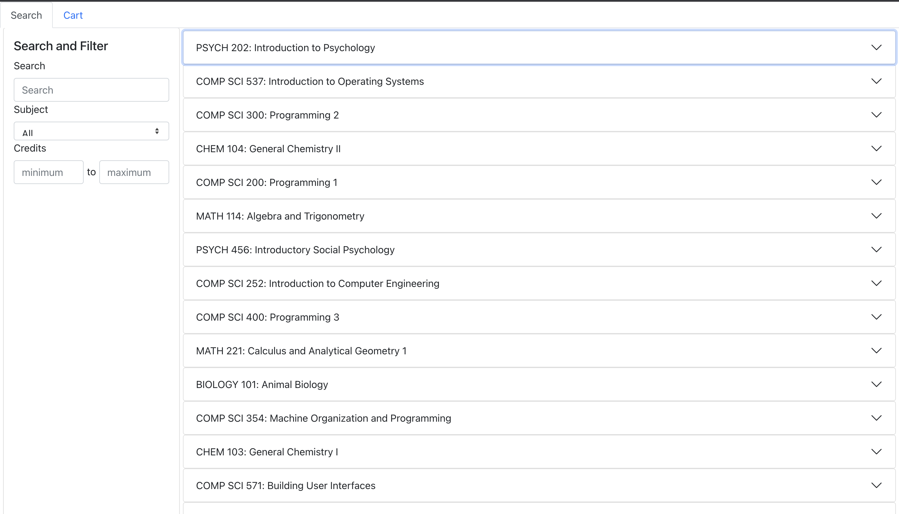
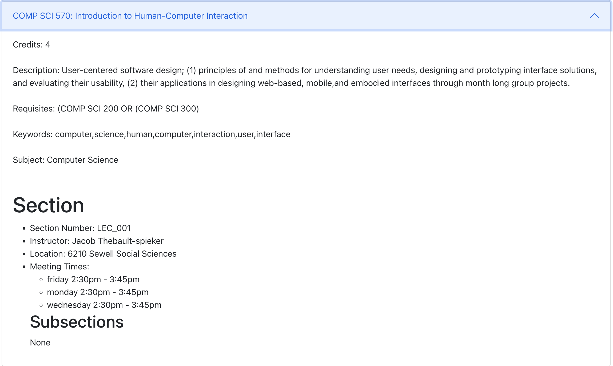

# Course search and enroll

I worked on this **ReactJS** application for a class project. It simulates a course enrollment system. Use this application to learn more about some of the courses offered by the University of Wisconsin-Madison.

## Overview

You can use this application to view course information, filter courses based on parameters, add courses to cart, and remove courses from the cart.

---

## Getting started

To use the app, follow these steps:

1. Open **terminal** and run the following command:

```
git clone https://github.com/amohapatra3/course-enroll-app.git

```

2. The command will create a new folder on your computer with the same name as the repository. Navigate to the folder by running the following command:

```
cd course-enroll-app
```

3. You will need npm packages to run the app. In order to install the necessary packages, run the following command:

```
npm install
```

4. Once you have installed the packages, run the following command:

```
npm start
```

5. You will now see the app deployed on your default browser at `localhost:3000`.

---

## Viewing course information

Each course is listed in an accordion display with a name and number, as shown below.



Click the course you want to learn more about. You will see an expanded view, as shown below.



The expanded view displays course information such as credits, description, requisites, search keywords, and subject. In addition, the view lists sections and subsections for each course (if the course has subsections).

Section information includes section number, instructor, location and meeting times. Subsection information includes the subsection number, location, and meeting times.

---

## Using the search feature

You can use the search feature to filter the course list based on specific parameters, as seen in the expanded view. The parameters include search keywords, subject, and credits. These parameters can be used in the following ways:

- Entering a keyword in the search bar. Only courses with the entered keyword are displayed.

- Selecting a subject from the dropdown menu. Only courses with the selected subject are displayed.

- Specifying a range of credits. Only courses in the credit range, maximum and minimum inclusive, are displayed.

  - If either value is unspecified, the application assumes the other as a bound. For example, only specifying a minimum of 3 credits will display all courses with 3 credits or more.

  - Similarly, specifying only a maximum of 3 credits will display courses with 3 credits or less.

---

## Utilizing the cart feature

The application allows you to add or remove courses from a cart. This simulates a real course enrollment system.

To use the cart, click on the **Cart** tab on the top left corner of the page. You can toggle between **Search** and **Cart** by clicking on either tab.

### Adding to cart

You can add to the cart in 3 different configurations:

1. Add all sections and subsections of a course.
2. Add a specific section and all subsections within that section.
3. Add a specific subsection of the course.

Follow these steps to add to the cart:

1. Click the course you want to add to the cart.
2. Click a button in the expanded view based on what course configuration you want to add to the cart.

   - Click **Add course to cart** to add a course and all its sections and subsections to the cart.

   **Note:** You will not be able to add individual sections or subsections of the added course to the cart after this action.

   - Click **Add section to cart** to add a specific section of the course, along with all its subsections.

   **Note:** You will not be able to add individual subsections of the added section to the cart after this action.

   - Click **Add subsection to cart** to add a specific course subsection to the cart.

3. You will now see course information on the right hand side of the page. This list of information represents the cart, and it will reflect the button(s) you clicked. New additions will append to the end of the list.

---

### Removing from cart

Click **Remove from cart** to remove courses from the cart.

---

### Stopping the application

Closing the `localhost:3000` browser tab will not stop the application.

Open **terminal** and press <kbd>Control+C</kbd> to stop the application from running.

Return to your browser and close the `localhost:3000` tab **after** stopping the application.
